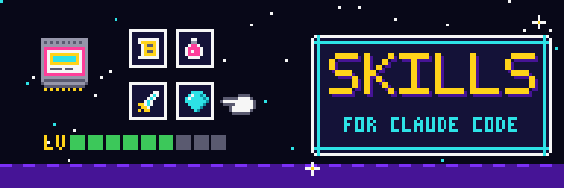

<p align="center">
  
</p>

# Skills for Claude Code

Three skills I wrote for my own Claude Code setup and use most days. Two of them fight the generic look AI output tends to have, one in code and one in web design. The third searches Reddit when normal web search comes back without the threads I wanted.

Each skill is a folder with a `SKILL.md`. Claude Code reads the description at the top of that file and loads the skill when a task matches it, so you never have to call one by name.

## What's here

| Skill | What it does |
|---|---|
| [`unslop-code`](skills/unslop-code) | Flags the things that make code read as AI-generated: leftover chat text, placeholder comments, swallowed errors, comments that narrate the obvious, names like `process_data`. It also points at the problems a linter won't catch, like tutorial-shaped boilerplate, invented APIs and over-engineering. A scanner script covers the surface patterns. |
| [`unslop-ui`](skills/unslop-ui) | The same idea for websites. It catches stock shadcn/Tailwind themes, purple gradients, gradient heading text, emoji used as icons and the centered hero with three feature cards. It also catches the newer cream background, serif and sage green combo that a lot of "tasteful" AI sites have moved to. It never suggests a replacement look. It asks you to make a choice you can explain. |
| [`reddit-search`](skills/reddit-search) | Searches Reddit through the Brave Search API and returns titles, links, subreddits and snippets. It doesn't scrape Reddit or use the Reddit API. It keeps a monthly request counter so a free-tier key doesn't run up charges. |

The research behind the two unslop skills comes from reading what developers and designers on Reddit actually point to when they call something AI slop. The references folder in each skill has the full list of tells and how often each one came up.

## Install

Copy the skills you want into your personal skills folder:

```bash
git clone https://github.com/UribeLandscapes/claude-skills.git
cp -r claude-skills/skills/unslop-code ~/.claude/skills/
cp -r claude-skills/skills/unslop-ui ~/.claude/skills/
cp -r claude-skills/skills/reddit-search ~/.claude/skills/
```

Start a new Claude Code session and they'll show up in the skill list. To use one in a single project only, put it in that project's `.claude/skills/` folder.

### reddit-search setup

You need a Brave Search API key. Brave asks for a card even on the free credit, which covers about 1,000 requests a month. On macOS you can keep the key in the Keychain so it never lands in your shell history:

```bash
security add-generic-password -s brave-search -a api-key -w
```

On other systems, export `BRAVE_SEARCH_API_KEY`. The script stops at 900 requests a month. Change that with `BRAVE_MONTHLY_CAP`.

Run the tests with:

```bash
cd skills/reddit-search && python3 -m unittest discover -s tests
```

### Scanners

The unslop scanners are plain Python 3 with no dependencies:

```bash
python3 skills/unslop-code/scripts/unslop_code_scan.py path/to/repo
python3 skills/unslop-ui/scripts/devibe_scan.py path/to/site --severity high
```

Treat what they report as a list of places to look. Some hits will be fine in context, and the deeper problems the skills describe need a person reading the diff.

## Third-party skills

| Skill | Author | Source | License |
|---|---|---|---|
| [continuous-learning-v2](third-party/affaan-m/ECC/continuous-learning-v2) | Affaan Mustafa | [ECC](https://github.com/affaan-m/ECC) | MIT |
| [caveman](third-party/JuliusBrussee/caveman/caveman) | Julius Brussee | [caveman](https://github.com/JuliusBrussee/caveman) | MIT |
| [humanizer](third-party/blader/humanizer) | Siqi Chen | [humanizer](https://github.com/blader/humanizer) | MIT |
| [napkin](third-party/blader/napkin) | blader | [napkin](https://github.com/blader/napkin) | MIT |
| [skill-creator](third-party/anthropics/skills/skill-creator) | Anthropic | [skills](https://github.com/anthropics/skills/tree/main/skills/skill-creator) | Apache-2.0 |

I used humanizer to write this README. I also use about 198 uncustomized ECC skills as-is; see the [ECC skills folder](https://github.com/affaan-m/ECC/tree/main/skills). The continuous-learning-v2 copy needs its hook wiring; see upstream for install. Changes from upstream are listed in the CHANGES.md in each author folder under [third-party](third-party/).

The agents I use alongside these skills are in a separate repo: [claude-agents](https://github.com/UribeLandscapes/claude-agents).

## License

MIT for my own skills. Files under [third-party](third-party/) keep their authors' licenses.
